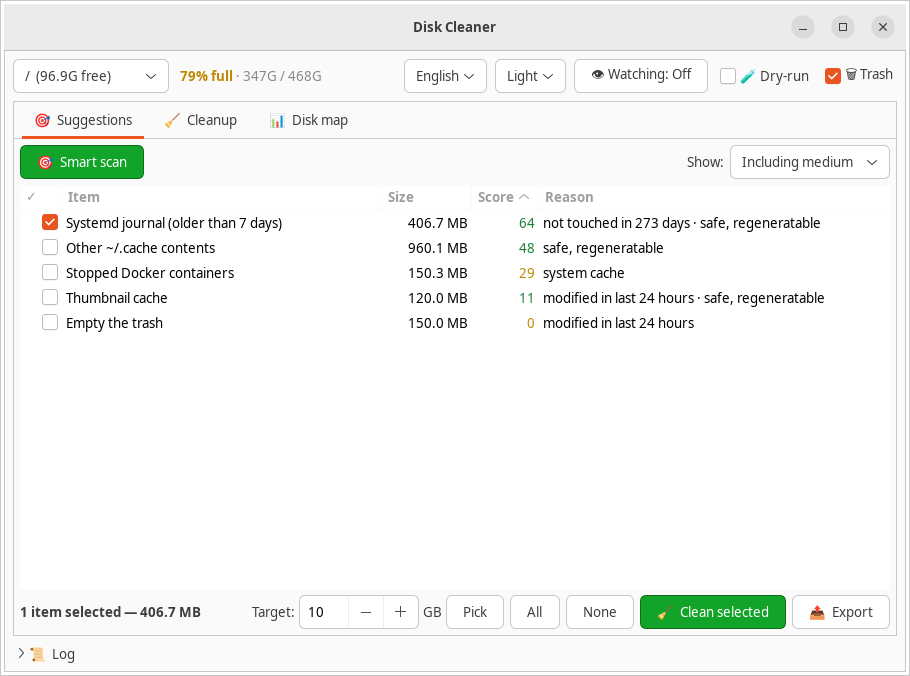
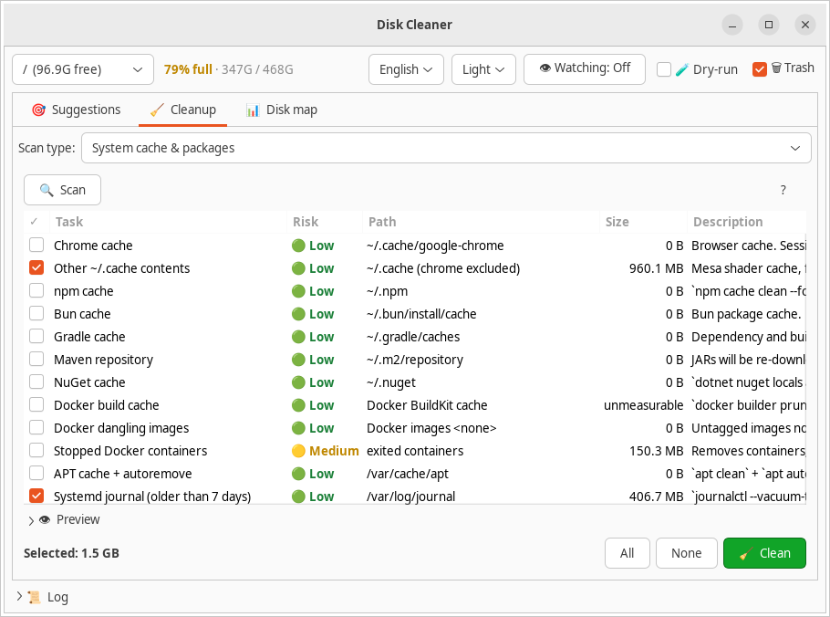
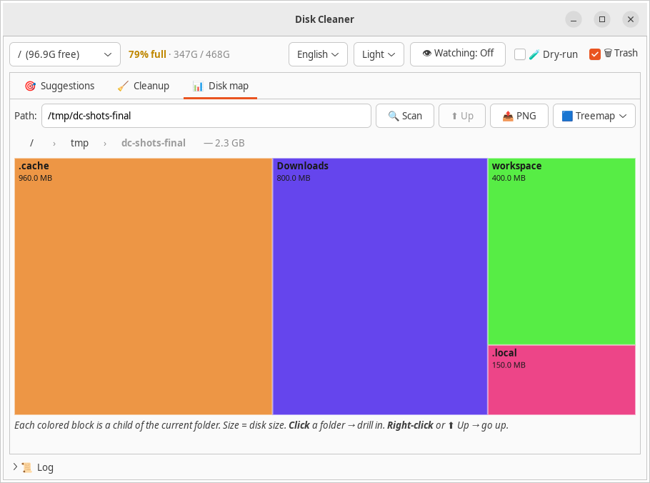
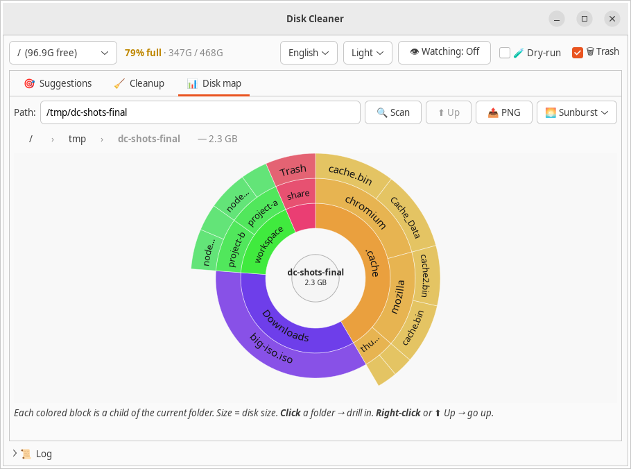
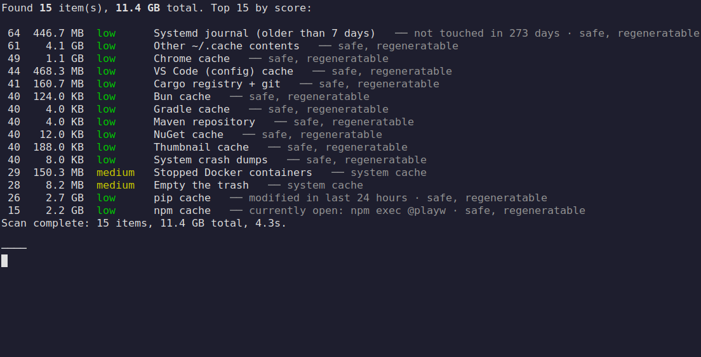
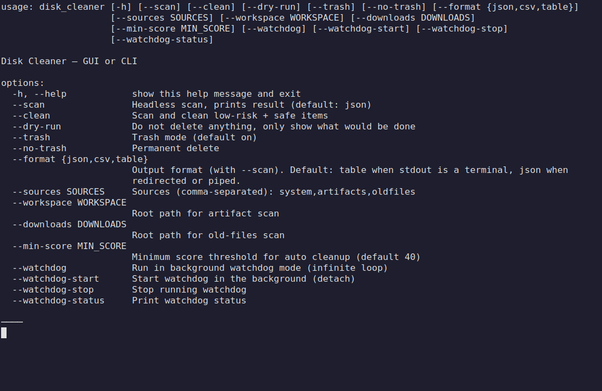
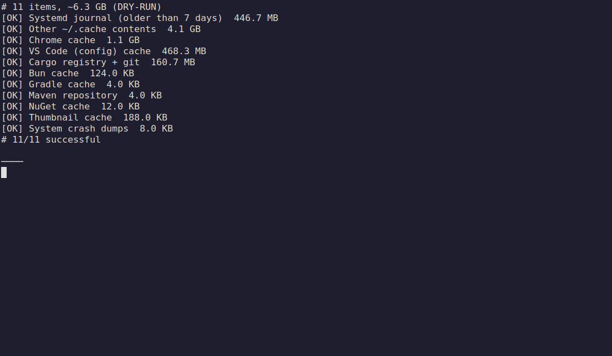
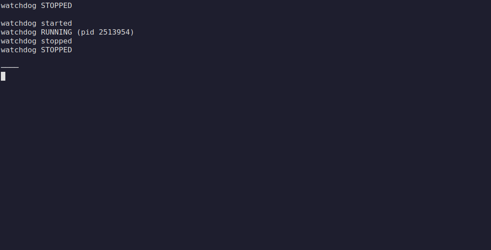
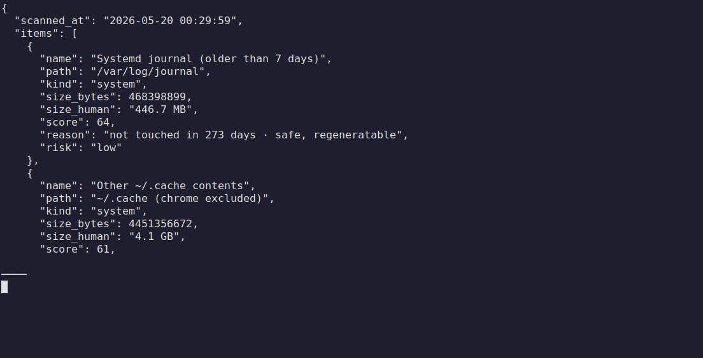

# Disk Cleaner

> A [Codechu](https://github.com/codechu) project. See [codechu/codechu-org](https://github.com/codechu/codechu-org) for organization-wide standards + brand guidelines.

Safe, transparent disk cleaner for Linux — with smart suggestions, an
interactive treemap and sunburst, and a quiet background watchdog.

[](LICENSE)
[](https://www.python.org/downloads/)
[](#)
[](https://github.com/codechu/disk-cleaner/releases/latest)
[](https://launchpad.net/~codechu/+archive/ubuntu/disk-cleaner)

<p align="center">
  <picture>
    <source media="(prefers-color-scheme: dark)" srcset="assets/logo/lockup-horizontal-dark.svg">
    
  </picture>
</p>

[Türkçe README](README.tr.md) · [Press kit](docs/PRESS_KIT.md) · [Brand](docs/BRAND.md) · [Versioning](docs/VERSIONING.md)

---

## Screenshots

| Smart suggestions | Cleanup tasks |
|---|---|
| <picture><source media="(prefers-color-scheme: dark)" srcset="assets/screenshots/en/dark/suggestion.png"></picture> | <picture><source media="(prefers-color-scheme: dark)" srcset="assets/screenshots/en/dark/cleanup.png"></picture> |

| Treemap | Sunburst |
|---|---|
| <picture><source media="(prefers-color-scheme: dark)" srcset="assets/screenshots/en/dark/treemap.png"></picture> | <picture><source media="(prefers-color-scheme: dark)" srcset="assets/screenshots/en/dark/sunburst.png"></picture> |

Real captures from the GUI via the [control API](docs/API.md) on an Xvfb virtual display, in light and dark themes. Turkish locale captures: [`assets/screenshots/tr/`](assets/screenshots/tr/). Reproducible playbook: [`assets/screenshots/README.md`](assets/screenshots/README.md).

### CLI

| Smart scan with summary | Help |
|---|---|
|  |  |

| Dry-run cleanup | Watchdog lifecycle | JSON output (pipe) |
|---|---|---|
|  |  |  |

Output format auto-switches: human-readable table with ANSI colors when stdout is a terminal, JSON when piped or redirected to a file. Progress streams on a single overwriting line on stderr.

---

## Features

- **Smart suggestions** — process-aware scoring (won't touch a cache your
  browser is currently using), age and size signals, with a one-line
  reason for every item.
- **Safety first** — trash mode by default (`gio trash`), explicit
  dry-run, active-project protection from git mtime, and the destructive
  control-API path is *blocked* (only the GUI can clean).
- **Interactive visualization** — squarified treemap and sunburst over
  any mount; zoom in by clicking, breadcrumb to zoom out.
- **Background watchdog** (opt-in) — notifies when free space drops
  below a threshold; runs detached, single-instance via PID file.
- **Control API** — Unix socket (`$XDG_RUNTIME_DIR/codechu/disk-cleaner/control.sock`),
  JSON per line — for IDE / automation integration.
- **Headless CLI** — `--scan`, `--clean --dry-run`, JSON / CSV / table
  output for scripts.
- **Custom cleaners** — drop JSON rules into
  `~/.config/codechu/disk-cleaner/cleaners/` and they appear in the UI.

## Install

### From source

```bash
# Linux deps (Ubuntu/Debian)
sudo apt install python3-gi gir1.2-gtk-3.0 python3-cairo

git clone https://github.com/codechu/disk-cleaner.git
cd disk-cleaner
pip install -e .
```

### Run

```bash
disk-cleaner          # GUI
disk-cleaner --scan   # headless JSON scan (full system; can be slow)
disk-cleaner --scan --sources artifacts --workspace .   # quick demo on a workspace
disk-cleaner --scan --format table | head
disk-cleaner --clean --dry-run
python3 -m disk_cleaner --help
```

### Language

UI defaults to English. Turkish translation ships out of the box; switch with:

```bash
DISK_CLEANER_LANG=tr disk-cleaner   # explicit override
LANG=tr_TR.UTF-8 disk-cleaner       # follow system locale
```

Adding a new language: `cd po && msginit -i messages.pot -l <lang> -o <lang>.po`, translate, then `make compile`. See [`po/Makefile`](po/Makefile).

## Supported platforms

| Tier | Status | Distributions |
|---|---|---|
| **Tier 1** | Fully supported, tested daily | Ubuntu 22.04+, Debian 12+, Linux Mint, Pop!_OS, elementary OS |
| **Tier 2** | Core works, package-manager tasks skipped | Fedora, Arch, openSUSE, NixOS, Alpine |

Current capability: Linux/GTK/Python. Other platforms (macOS, Windows, BSD) are not supported.

## Architecture

See [docs/ARCHITECTURE.md](docs/ARCHITECTURE.md) for the modular layout,
the Strategy pattern (`Scanner`, `Cleaner`, `VizStrategy`, Presenter
controllers) and the `AppContext` composition root. Design principles
are written down in [DESIGN_PRINCIPLES.md](DESIGN_PRINCIPLES.md) — read
those before opening a PR.

## Contributing

PRs welcome. Start with [CONTRIBUTING.md](CONTRIBUTING.md). Style: `ruff`,
tests via `pytest`, commits in Conventional Commits format.

## Acknowledgments

Inspired by [BleachBit](https://www.bleachbit.org/),
[Filelight](https://apps.kde.org/filelight/),
[ncdu](https://dev.yorhel.nl/ncdu) and
[Czkawka](https://github.com/qarmin/czkawka) — credit to those projects
for showing the way.

## License

MIT — see [LICENSE](LICENSE).
