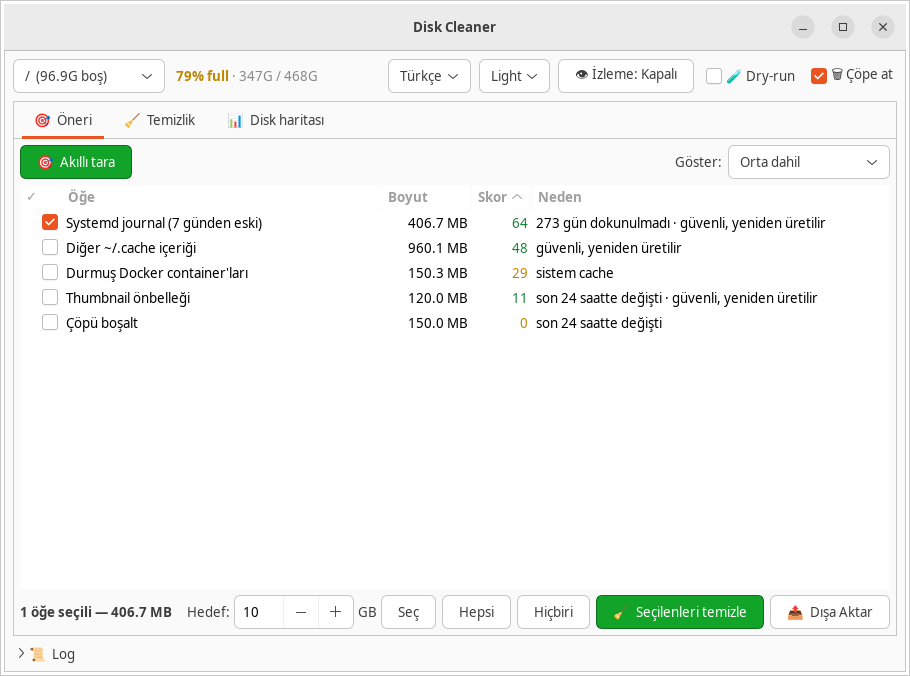
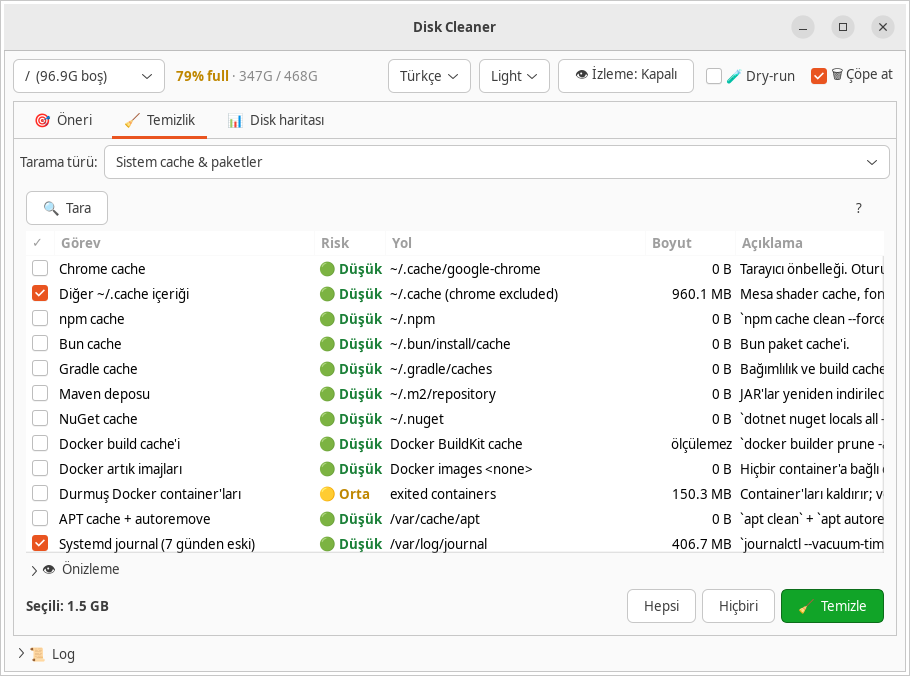
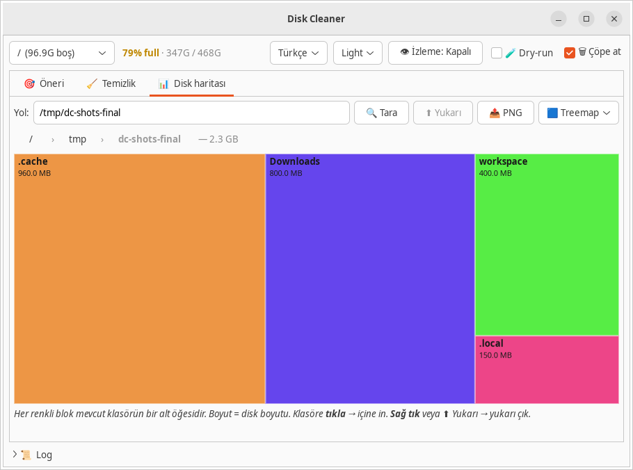
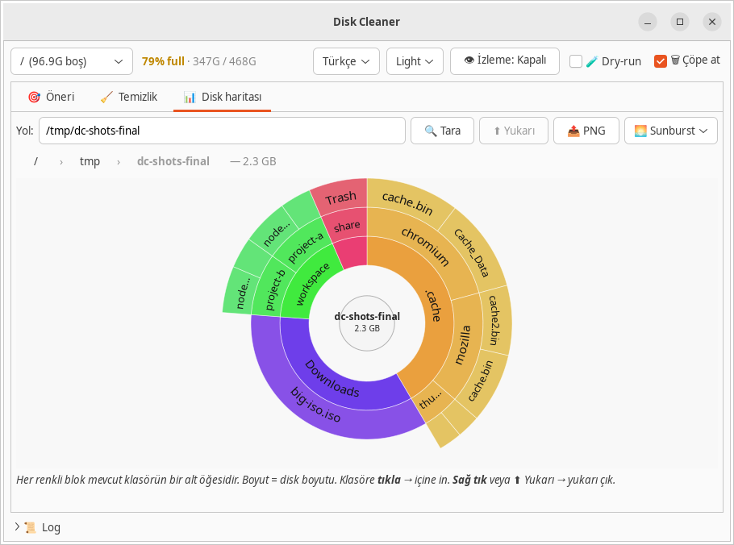

# Disk Cleaner

> Bir [Codechu](https://github.com/codechu) projesi. Org-wide standartlar: [codechu/codechu-org](https://github.com/codechu/codechu-org).

Linux için güvenli, şeffaf disk temizleyici — akıllı öneriler,
interaktif treemap & sunburst görselleştirmesi ve sessiz arka plan
watchdog'u ile.

[](LICENSE)
[](https://www.python.org/downloads/)
[](#)

<p align="center">
  <picture>
    <source media="(prefers-color-scheme: dark)" srcset="assets/logo/lockup-horizontal-dark.svg">
    
  </picture>
</p>

[English README](README.md) · [Press kit](docs/PRESS_KIT.md) · [Brand](docs/BRAND.md) · [I18N](docs/I18N.md)

---

## Ekran görüntüleri

| Akıllı öneriler | Temizlik görevleri |
|---|---|
| <picture><source media="(prefers-color-scheme: dark)" srcset="assets/screenshots/tr/dark/suggestion.png"></picture> | <picture><source media="(prefers-color-scheme: dark)" srcset="assets/screenshots/tr/dark/cleanup.png"></picture> |

| Treemap | Sunburst |
|---|---|
| <picture><source media="(prefers-color-scheme: dark)" srcset="assets/screenshots/tr/dark/treemap.png"></picture> | <picture><source media="(prefers-color-scheme: dark)" srcset="assets/screenshots/tr/dark/sunburst.png"></picture> |

GUI'den [control API](docs/API.md) ile Xvfb sanal ekranında alınmış gerçek görüntüler — açık ve koyu tema. İngilizce lokali için: [`assets/screenshots/en/`](assets/screenshots/en/). Reprodüksiyon: [`assets/screenshots/README.md`](assets/screenshots/README.md).

---

## Özellikler

- **Akıllı öneri** — süreç-farkındalıklı skorlama (tarayıcı şu an
  kullanıyorsa cache'ine dokunmaz), yaş + boyut sinyalleri, her öğe için
  tek satır gerekçe.
- **Güvenlik önce** — çöp kutusu modu varsayılan (`gio trash`), açık
  dry-run, git mtime tabanlı aktif proje koruması, yıkıcı API yolu
  *BLOKE* (sadece GUI temizleyebilir).
- **İnteraktif görselleştirme** — herhangi bir mount için squarified
  treemap + sunburst; tıkla yakınlaş, breadcrumb ile çık.
- **Arka plan watchdog'u** (opt-in) — boş alan eşiğin altına düşünce
  bildirir; PID dosyasıyla tek instance, detached.
- **Control API** — Unix socket
  (`$XDG_RUNTIME_DIR/codechu/disk-cleaner/control.sock`), satır başına
  JSON — IDE / otomasyon entegrasyonu için.
- **Headless CLI** — `--scan`, `--clean --dry-run`, JSON / CSV / table
  çıktı.
- **Özel temizleyiciler** — `~/.config/codechu/disk-cleaner/cleaners/`
  altına JSON kural at, UI'da görünsün.
- **Çok dilli arayüz** — İngilizce + Türkçe, Settings'te değiştirilir.
- **Karanlık/aydınlık tema** — Settings'te seçilir (Auto/Light/Dark).

## Kurulum

### Kaynaktan

```bash
# Linux bağımlılıkları (Ubuntu/Debian)
sudo apt install python3-gi gir1.2-gtk-3.0 python3-cairo gettext

git clone https://github.com/codechu/disk-cleaner.git
cd disk-cleaner
pip install -e .
cd po && make compile   # Türkçe çevirileri derler
```

### Çalıştır

```bash
disk-cleaner          # GUI (sistem diline göre)
DISK_CLEANER_LANG=tr disk-cleaner   # zorla Türkçe
DISK_CLEANER_LANG=en disk-cleaner   # zorla İngilizce
disk-cleaner --scan   # headless JSON tarama
disk-cleaner --scan --format table | head
disk-cleaner --clean --dry-run
python3 -m disk_cleaner --help
```

## Veri yerleşimi (XDG)

```
~/.config/codechu/disk-cleaner/         # ayarlar, özel temizleyici kuralları
~/.cache/codechu/disk-cleaner/          # disk usage cache (regenerate edilebilir)
~/.local/share/codechu/disk-cleaner/    # snapshot DB (kalıcı geçmiş)
$XDG_RUNTIME_DIR/codechu/disk-cleaner/  # pid, socket, lock
```

Tüm Codechu ürünleri `codechu/<product>/` namespace altında.

## Mimari

Modüler yerleşim, Strategy deseni (`Scanner`, `Cleaner`, `VizStrategy`)
ve `AppContext` composition root için
[docs/ARCHITECTURE.md](docs/ARCHITECTURE.md). PR açmadan önce
[DESIGN_PRINCIPLES.md](DESIGN_PRINCIPLES.md) oku.

## Katkı

PR'lar memnuniyetle. [CONTRIBUTING.md](CONTRIBUTING.md) ile başla. Stil:
`ruff`, testler `pytest`, commitler Conventional Commits formatında.

## Teşekkürler

[BleachBit](https://www.bleachbit.org/),
[Filelight](https://apps.kde.org/filelight/),
[ncdu](https://dev.yorhel.nl/ncdu) ve
[Czkawka](https://github.com/qarmin/czkawka) yol gösterdi — teşekkürler.

## Lisans

MIT — [LICENSE](LICENSE).
